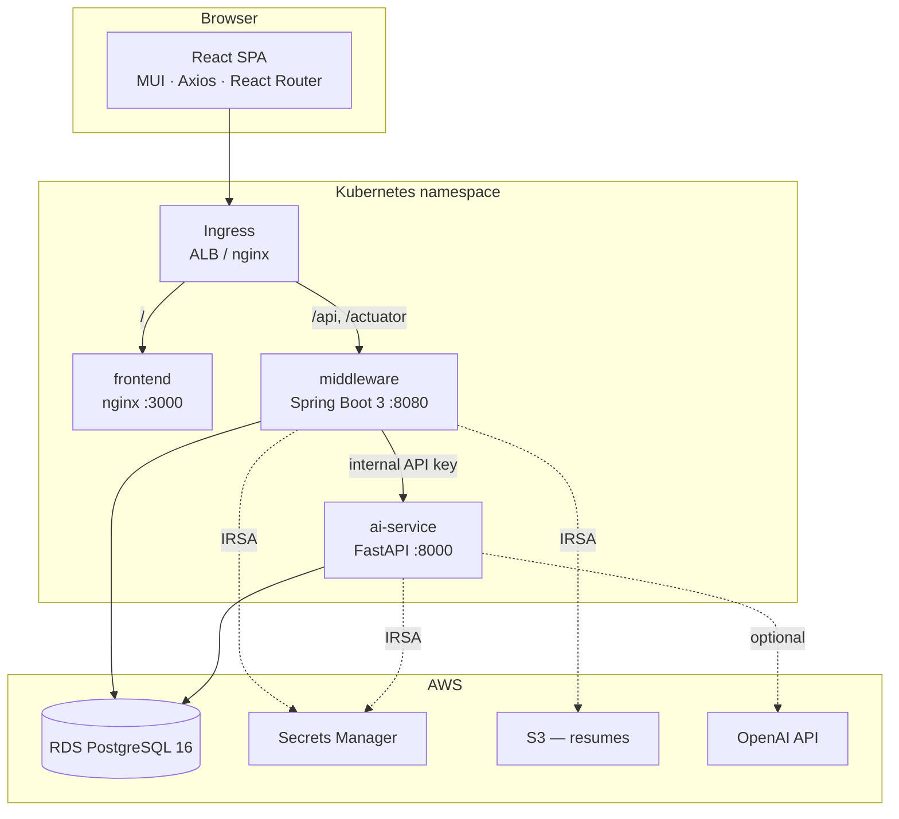
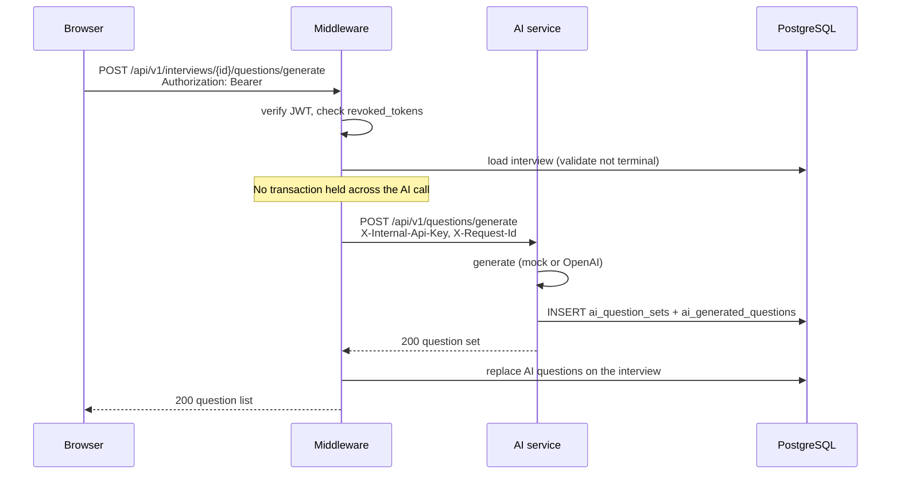
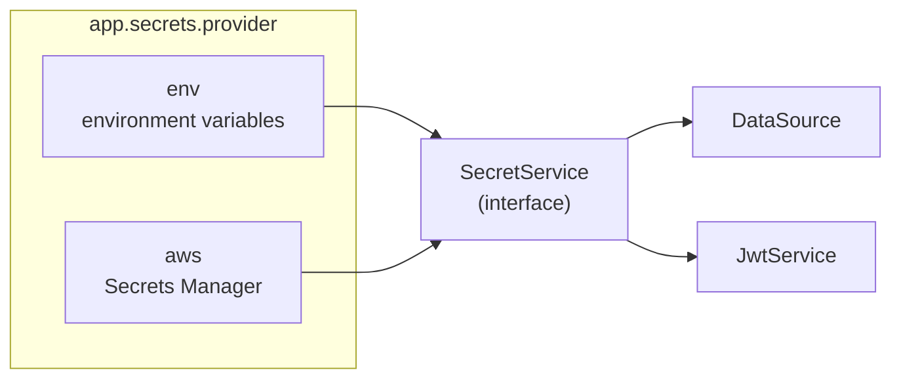
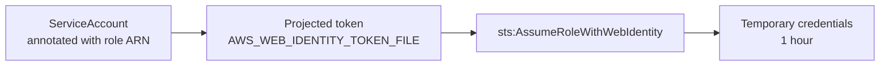
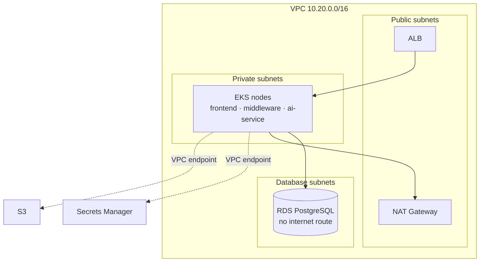

# Architecture

## Purpose

This is a working application built to be a **DevOps training platform**. It has
enough real functionality — authentication, CRUD, file upload, an external AI
dependency, a database — to make containerisation, Kubernetes, GitOps, IRSA,
monitoring and production troubleshooting meaningful rather than theoretical.

Where a design decision traded application sophistication for operational
teaching value, that trade is noted explicitly below.

## System overview



The AI service has **no Ingress path**. It is reachable only from the middleware
over the cluster network, authenticated with a shared internal key. Exposing it
publicly would let anyone spend the platform's model tokens.

## Request flow: generating interview questions

This is the path that exercises every component, and the one the smoke test asserts.



Two decisions here are deliberate and load-bearing:

**The AI call happens outside any database transaction.** A generation can take
tens of seconds. Wrapping it in `@Transactional` would pin one connection from a
10-connection pool for its duration; a slow AI provider would exhaust the pool and
take down login and candidate CRUD along with question generation. `InterviewQuestionWriter`
exists purely to own the short write transaction that follows.

**`X-Request-Id` propagates across the hop.** Both services put it in the MDC and
emit it as a top-level JSON log field, so one correlation id spans both services'
logs. This is the difference between debugging a distributed failure and guessing.

## Components

| Component | Stack | Port | Responsibility |
|---|---|---|---|
| `frontend/` | React 18, MUI, Axios, React Router, Vite | 3000 | SPA served by nginx |
| `middleware/` | Spring Boot 3, Java 21, Spring Security, JPA, Flyway | 8080 | Auth, business logic, schema authority |
| `backend/` | FastAPI, Pydantic v2, SQLAlchemy 2 | 8000 | Question generation, answer evaluation |
| PostgreSQL | 16 | 5432 | Single shared database |

### Why the middleware owns the schema

Both services read and write one database, but **Flyway in the middleware creates
every table**, including the three the Python service maps to (`V2__create_ai_schema.sql`).

The alternative — each service migrating its own tables — needs two migration
histories against one database plus a deployment ordering contract between them.
At this size that costs more than it buys. `backend/tests/test_schema_parity.py`
compares the SQLAlchemy models against the migration and fails if they drift,
which is what makes the shared arrangement safe rather than fragile.

This is a documented simplification, not a recommendation for a large system. A
real microservice platform would give each service its own database.

## Configuration and secrets

Nothing environment-specific is baked into an image. Every value is an environment
variable, and the same image runs on Docker Compose and on EKS.



The middleware has **no `spring.datasource.url` and no password in any config
file**. `DataSourceConfig` builds the Hikari pool at startup from whatever
`SecretService` returns. Defining that bean makes Spring Boot's
`DataSourceAutoConfiguration` back off, and Flyway and JPA both pick it up.

If secret resolution fails, the context never refreshes — so a wrong secret ARN or
a broken IRSA role is a pod that fails its startup probe, not a service that
accepts traffic and then 500s.

The AI service mirrors this exactly with `SecretProvider` in `app/core/secrets.py`.

### IRSA: how "no access keys" actually works



Both services build their AWS clients with the **default credential provider
chain** and nothing else. That single decision is what makes the code identical
between a laptop (SSO profile) and the cluster (IRSA).

Three details make it a real control rather than a nominal one:

1. **The trust policy's `sub` condition** pins the role to
   `system:serviceaccount:<namespace>:<name>`. Without it, any pod in the cluster
   could assume it.
2. **Resource-scoped policies** — `GetSecretValue` on two specific ARNs, not `*`.
3. **IMDSv2 with hop limit 1** on the nodes, so a compromised pod cannot reach the
   instance metadata service and steal the *node* role's credentials, which would
   route around IRSA entirely.

## Security

| Control | Implementation |
|---|---|
| Authentication | HS256 JWT, 30 min access + 8 h refresh |
| Password storage | BCrypt cost 10 |
| Logout | `revoked_tokens` table, checked by primary key on every request |
| Refresh | Rotated on use; the presented token is revoked in the same transaction |
| Authorization | `@PreAuthorize` per endpoint, plus query-level scoping for `CANDIDATE` |
| Service-to-service | Shared internal API key, compared with `hmac.compare_digest` |
| Transport | **HTTP only.** The ALB has no certificate - there is no domain to issue one for. A JWT crosses the internet in clear text, so this is a training cluster and nothing else |
| Containers | Non-root uid 10001, read-only root filesystem, all capabilities dropped |

**Why a revocation table rather than pure stateless JWT.** Logout has to take
effect immediately across every replica. The cost is one primary-key lookup per
request; the alternative is a token that stays valid for 30 minutes after a user
signs out. Expired rows are pruned hourly by `TokenCleanupService`.

**Candidate scoping is enforced in the query, not the controller.** `InterviewService.search`
forces a `candidate_id` filter for `CANDIDATE` callers, so no endpoint can leak
another candidate's data by forgetting a check.

## Observability

| Signal | Middleware | AI service |
|---|---|---|
| Liveness | `/actuator/health/liveness` | `/health/liveness` |
| Readiness | `/actuator/health/readiness` | `/health/readiness` |
| Metrics | `/actuator/prometheus` | `/metrics` |
| Logs | JSON via logstash-logback-encoder | JSON via a custom formatter |

**Liveness never touches the database.** A database blip must not restart every
pod — readiness already removes them from the Service, and they recover on their
own once it returns. Getting this backwards produces a restart storm during a
downstream outage, which is one of the troubleshooting scenarios this platform
is designed to demonstrate.

**AI service health is excluded from the middleware's readiness group** for the
same reason. It is reported as a component of `/actuator/health` for dashboards,
but an AI outage degrades question generation rather than taking every middleware
pod out of the Service.

Metric cardinality is controlled deliberately: the AI service labels by *route
template* (`/api/v1/questions/sets/{set_id}`), never the concrete URL, and
collapses status codes to their class. Labelling by raw path would create one
time series per interview id.

## Data model

```
users ──────┬──< candidates ──┬──< resumes
            │                 └──< interviews ──┬──< interview_questions
            ├──< interviews (interviewer_id)    ├──── interview_results (1:1)
            └──< revoked_tokens                 ├──< ai_question_sets ──< ai_generated_questions
                                                └──< ai_evaluations
```

Conventions and why:

- **Application-generated UUID primary keys**, not `gen_random_uuid()`. Keeps the
  runtime database user free of extension-creation privilege on RDS, and lets a
  service build a full object graph before its first flush.
- **`varchar` + `CHECK` instead of native enums.** Readable in `psql`, and adding
  a value is an ordinary migration rather than an `ALTER TYPE`.
- **`timestamptz` everywhere**, written in UTC.
- **Failed AI generations are stored**, not just successful ones, so error rate and
  token spend are answerable from SQL rather than from logs that may have rotated.

## Deployment topology



Database subnets have **no route to a NAT gateway at all** — RDS never needs
outbound internet, so it does not get any. Secrets Manager and S3 are reached
through VPC endpoints, keeping that traffic off the NAT gateway (both a cost and a
security decision).

## Known simplifications

Honest about what this is not:

| Simplification | Why | What production would do |
|---|---|---|
| One database shared by two services | One migration authority; avoids a deployment ordering contract | A database per service |
| `frontend.apiBaseUrl` read at runtime from `window.__APP_CONFIG__` | One image promoted across environments | Same — this one is genuinely correct |
| Seed data in `V3` with known passwords | A populated demo on first start | Skip the migration; provision accounts out of band |
| In-cluster PostgreSQL StatefulSet available | Compose works with no AWS account | On EKS it is RDS only; the chart has no StatefulSet |
| Local disk storage backend | Compose works with no S3 | S3 — `S3FileStorageService` exists, and switching to it also removes the ReadWriteOnce volume that forces `Recreate` |
| No distributed tracing | Request-id correlation is enough at three services | OpenTelemetry spans across the hop |
| No rate limiting | Out of scope for the training goal | Ingress-level or a token bucket per principal |

## Further reading

- [SETUP.md](SETUP.md) — run it locally
- [API.md](API.md) — endpoint reference
- [FOLDER_STRUCTURE.md](FOLDER_STRUCTURE.md) — what lives where
- [RBAC_VS_IRSA.md](RBAC_VS_IRSA.md) — the two directions of cluster authorisation
- [TROUBLESHOOTING.md](TROUBLESHOOTING.md) — failure modes and how to diagnose them
- [`../CLAUDE.md`](../CLAUDE.md) — infrastructure, deployment and the conventions
